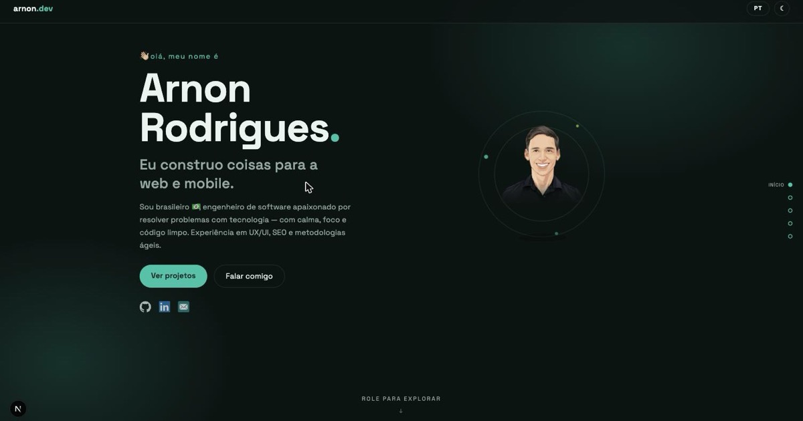

# arnon.dev

<div align="center">



**Personal portfolio of Arnon Rodrigues** — a single-page, zen-themed site with a meditating avatar, scroll-driven animations, dark/light themes and 8 languages.

[**arnon.dev**](https://arnon.dev)

</div>

## Features

- 🧘 **Zen design** — meditating vector portrait with floating animation, pulsing auras and orbiting particles
- 🌗 **Dark / light theme** — dark by default, persisted in `localStorage`, no flash on reload
- 🌍 **8 languages** — auto-detected from the browser (`en`, `pt`, `es`, `fr`, `de`, `it`, `ja`, `zh-CN`), with a language picker in the header
- 🎬 **Scroll-driven effects** — hero parallax, one-shot section reveals with staggers, horizontal-parallax watermarks and chapter dots
- 📊 **Live GitHub stats** — public repos and followers fetched client-side, with graceful fallback
- ⚡ **Fully static** — no server required; every page is prerendered at build time

## Stack

Next.js (Pages Router) · React · TypeScript · CSS Modules · [Space Grotesk](https://fonts.google.com/specimen/Space+Grotesk)

## Development

```bash
npm install
npm run dev        # http://localhost:3000
npm run build      # production build
npm run lint       # eslint
```

## Content & translations

All content lives in `src/data/*.json` **in English only**. Other languages come from
`src/data/translations.json`, an EN → language cache filled by:

```bash
npm run translate
```

The script finds untranslated strings, translates them with Google Translate and appends
them to the cache — existing entries (including manual corrections) are never overwritten.
To add a language, add its code to `TARGETS` in `scripts/translate.mjs` and run the script.

---

<div align="center">

*calmly made by [Arnon Rodrigues](https://github.com/arnonrdp)*

</div>
